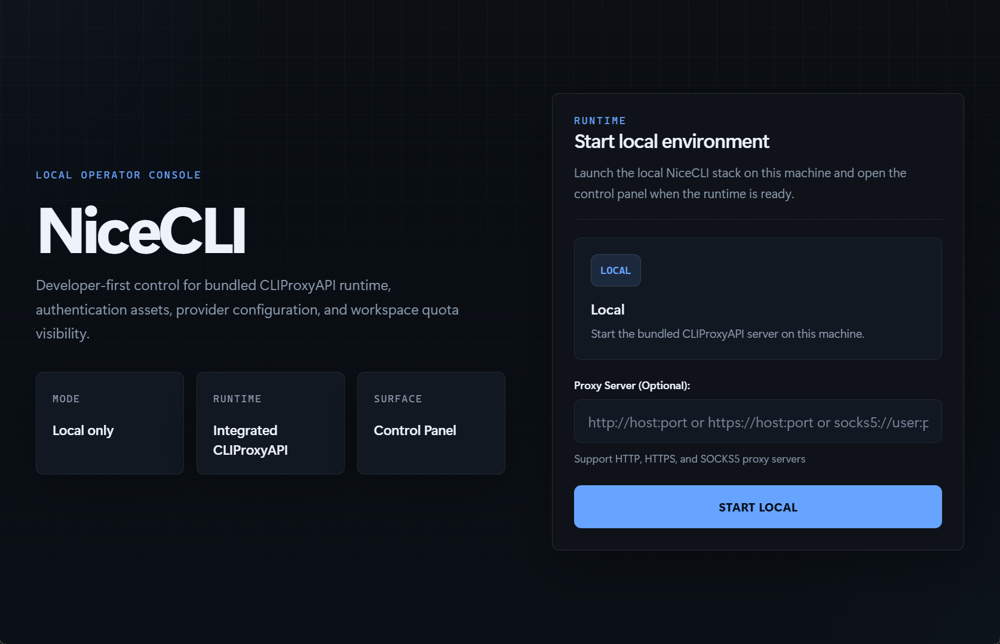
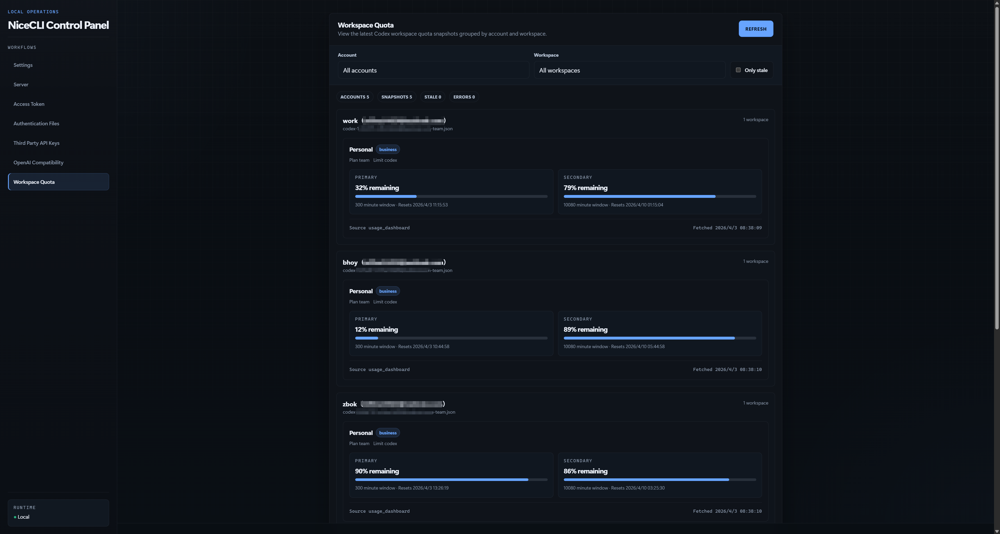

<p align="center">
  
</p>

<p align="center">
  
  
  
  
  
</p>

<p align="center">
  <a href="./README.md">English</a> | <a href="./README_CN.md">中文</a>
</p>

<h3 align="center">
  A local-first desktop control plane for CLIProxyAPI.
</h3>

<p align="center">
  NiceCLI is a Windows-first fork and productized rebuild of EasyCLI, focused on a cleaner local-only workflow, an embedded desktop-lite CLIProxyAPI backend, and a more polished developer-facing control panel.
</p>

<p align="center">
  
</p>

<p align="center">
  
</p>

## Feature highlights

NiceCLI keeps the original operational value of EasyCLI, but narrows the product around the workflow that matters most for this project: launch locally, manage auth files, inspect runtime state, and view quota across multiple workspaces under the same ChatGPT account without remote-management setup.

- **Local-only startup** - no remote connection flow, no remote-management password prompt, and a faster path from launch to usable control panel
- **Embedded CLIProxyAPI runtime** - the desktop app packages the backend it needs and starts the local runtime for you
- **Codex Workspace Quota visibility** - view quota across multiple workspaces under the same ChatGPT account, with remaining usage, progress bars, and periodic auto-refresh
- **Authentication file notes** - attach notes to auth files and surface them in the quota view as `note (email)`
- **Refined desktop UX** - custom NiceCLI branding, reduced startup friction, simplified navigation, and a more structured dark UI
- **Theme and language settings** - built-in dark/light mode switching and i18n groundwork for localized UI
- **Portable distribution** - current releases are prepared as a portable `nicecli.exe` for direct local use

## Why NiceCLI

EasyCLI is a strong operational base, but this fork is intentionally narrower. NiceCLI removes remote-first complexity, trims flows that do not fit the local desktop use case, and adds the product details needed for everyday account and quota operations, especially when you need to view quota across multiple workspaces under the same ChatGPT account.

The project is centered on:

- launching a local stack quickly
- keeping auth-file management practical
- making Codex workspace issues easier to identify when you view quota across multiple workspaces under the same ChatGPT account
- preserving a single-user desktop experience instead of a remote admin console

## Quick start

For end users on Windows:

1. Install Microsoft Edge WebView2 Runtime if it is not already available on the machine.
2. Open the portable release directory, for example `NiceCLI_Portable/v0.3.5/`.
3. Run `nicecli.exe`.
4. NiceCLI starts the local runtime and opens the control panel.

From there you can:

- manage authentication files
- add notes to auth files
- inspect Codex Workspace Quota and view quota across multiple workspaces under the same ChatGPT account
- adjust local UI settings such as theme and language

## Development

This workspace currently uses the following active source roots:

- `source_code/EasyCLI-0.1.32` - NiceCLI desktop frontend and Tauri shell
- `source_code/CLIProxyAPI-6.9.7` - embedded CLIProxyAPI backend fork


Prerequisites for local development:

- Node.js 18+
- Rust toolchain for Tauri builds
- Go toolchain for CLIProxyAPI builds
- WebView2 Runtime on Windows

## Build

The current active source tree lives under `source_code/`. If you use the root-level helper scripts, make sure their workspace paths match your local layout.

Development-style build:

```powershell
powershell -ExecutionPolicy Bypass -File .\build-windows-dev.ps1
```

Installer/bundled build:

```powershell
powershell -ExecutionPolicy Bypass -File .\build-windows.ps1
```

The build flow:

- compiles the CLIProxyAPI backend
- places bundled backend resources into the Tauri app
- prepares frontend assets
- builds `nicecli.exe`

## Project layout

- `README.md` - project overview
- `plan.md` - current execution plan and working notes
- `nicecli-logo.png` - NiceCLI branding asset
- `NiceCLI_Portable/` - portable release outputs
- `source_code/` - active working source trees
- `build-windows-dev.ps1` - portable/dev executable build
- `build-windows.ps1` - bundled installer build

Within `source_code/`:

- `EasyCLI-0.1.32/`
  - `login.html`, `settings.html`, `css/`, `js/` - desktop UI
  - `src-tauri/` - Rust/Tauri host app
- `CLIProxyAPI-6.9.7/`
  - `cmd/server/` - backend entrypoint
  - `internal/` - runtime, API, quota, and management logic
  - `sdk/` - routing/auth scheduling and provider execution layers

## What changed from EasyCLI

This fork has already moved away from stock EasyCLI in several visible ways:

- renamed and rebranded as NiceCLI
- local-only login and startup path
- embedded backend packaging for desktop use
- removed update-check friction during launch
- custom Workspace Quota panel behavior and data presentation to view quota across multiple workspaces under the same ChatGPT account
- auth-file note support wired into quota visibility
- custom visual system, theme controls, and language support foundation
